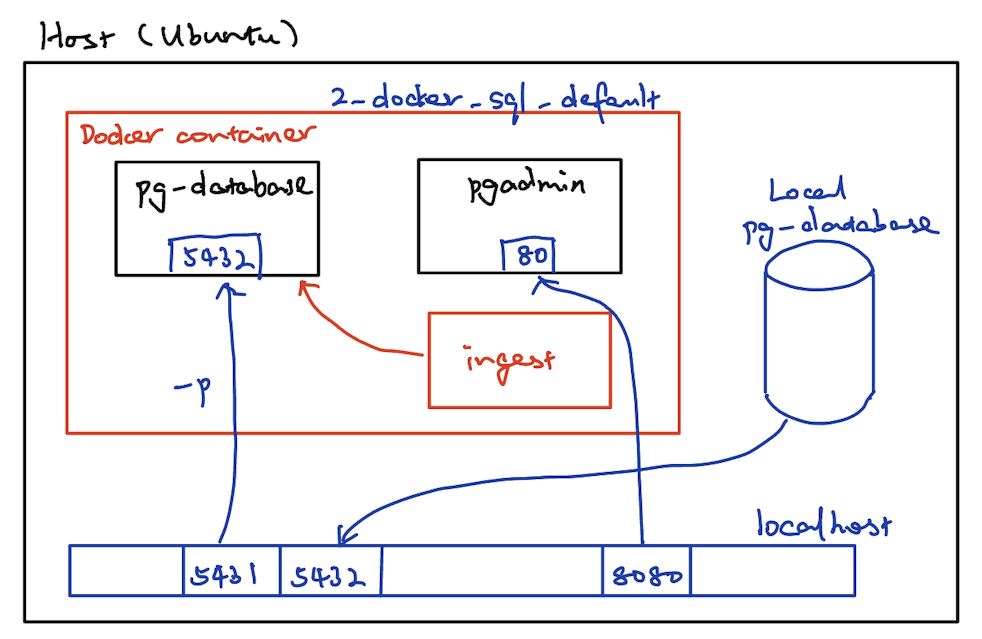
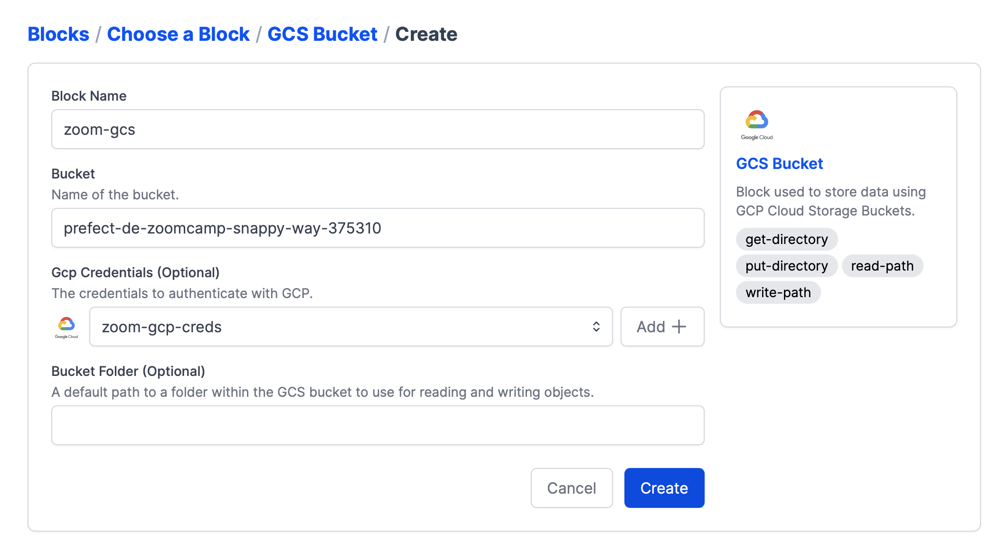

# Week 1: Introduction & Prerequisites

## SQL refresher

Join the ```yellow_taxi_trips``` table with the ```zones``` table and output selected information using ```WHERE``` clause:

```sql
SELECT 
	tpep_pickup_datetime,
	tpep_dropoff_datetime,
	total_amount,
	CONCAT(zpu."Borough", ' / ', zpu."Zone") AS "pickup_loc",
	CONCAT(zdo."Borough", ' / ', zdo."Zone") AS "dropoff_loc"
FROM
	yellow_taxi_trips t,
	zones zpu,
	zones zdo
WHERE
	t."PULocationID" = zpu."LocationID" AND
	t."DOLocationID" = zdo."LocationID"
LIMIT 100;
```

or using the ```JOIN``` clause:

```sql
SELECT 
	tpep_pickup_datetime,
	tpep_dropoff_datetime,
	total_amount,
	CONCAT(zpu."Borough", ' / ', zpu."Zone") AS "pickup_loc",
	CONCAT(zdo."Borough", ' / ', zdo."Zone") AS "dropoff_loc"
FROM
	yellow_taxi_trips t JOIN zones zpu
		ON t."PULocationID" = zpu."LocationID"
	JOIN zones zdo
		ON t."DOLocationID" = zdo."LocationID"
LIMIT 100;
```

Check if there is empty pick up ID or drop off ID in ```yellow_taxi_trips``` table:
```sql
SELECT 
	tpep_pickup_datetime,
	tpep_dropoff_datetime,
	total_amount,
	"PULocationID",
	"DOLocationID"
FROM
	yellow_taxi_trips t
WHERE
	"PULocationID" is NULL OR
	"DOLocationID" is NULL
```

Check if there is pick up ID or drop off ID in ```yellow_taxi_trips``` table that is not present in the ```zones``` table:
```sql
SELECT 
	tpep_pickup_datetime,
	tpep_dropoff_datetime,
	total_amount,
	"PULocationID",
	"DOLocationID"
FROM
	yellow_taxi_trips t
WHERE
	"PULocationID" NOT IN (
		SELECT "LocationID" FROM zones) OR
	"DOLocationID" NOT IN (
		SELECT "LocationID" FROM zones)
```

Delete elements in table:
```sql
DELETE FROM zones WHERE "LocationID" = 142;
```

Get only the date from datetime field:

```sql
DATE_TRUNC('DAY', tpep_dropoff_datetime)
```

or:
```sql
CAST(tpep_dropoff_datetime AS DATE)
```

Calculate how many trips there are for each day and rank by date:
```sql
SELECT
	CAST(tpep_dropoff_datetime AS DATE) as "day",
	COUNT(1) as "COUNT",
    MAX(total_amount),
    MAX(passenger_count)
FROM
	yellow_taxi_trips t
GROUP BY
	CAST(tpep_dropoff_datetime AS DATE)
ORDER BY "day" ASC;
```

Group by multiple fields:
```sql
SELECT
	CAST(tpep_dropoff_datetime AS DATE) as "day",
    "DOLocationID",
	COUNT(1) as "COUNT",
    MAX(total_amount),
    MAX(passenger_count)
FROM
	yellow_taxi_trips t
GROUP BY
	1, 2
ORDER BY
    "day" ASC,
    "DOLocationID" ASC;
```
## Port mapping and networks in Docker

```pg-database``` and ```pgadmin``` are running in a docker cotnainer in a specified network, and this docker container is running on a cloud instance. We can use ```docker network ls``` to see available networks. In this example, because local database is already hosted on port 5432, we need to map the database in the container to another port in localhost (here as 5431).



The docker-compose yaml file looks like this:
```
services:
  pg-database:
    image: postgres:13
    environment:
      - POSTGRES_USER=root
      - POSTGRES_PASSWORD=root
      - POSTGRES_DB=ny_taxi
    volumes:
      - ./ny_taxi_postgres_data:/var/lib/postgresql/data:rw
    ports:
      - 5431:5432
  pgadmin:
    image: dpage/pgadmin4
    environment:
      - PGADMIN_DEFAULT_EMAIL=admin@admin.com
      - PGADMIN_DEFAULT_PASSWORD=root
    volumes:
      - ./data_pgadmin:/var/lib/pgadmin
    ports:
      - 8080:80
```

In order for the ingestion step to send data to the docker container, we need specify the network properly:
```bash
URL="https://d37ci6vzurychx.cloudfront.net/trip-data/yellow_tripdata_2021-01.parquet"

docker run -it \
  --network=2_docker_sql_default \
  taxi_ingest:v001 \
    --user=root \
    --password=root \
    --host=pg-database \
    --port=5432 \
    --db=ny_taxi \
    --table_name=yellow_taxi_trips \
    --url=${URL}
```

To start this mapped database locally, we can run:
```bash
pgcli -h localhost -p 5431 -u root -d ny_taxi
```

## Setting up the envinronment on GCP

* [Create SSH keys](https://cloud.google.com/compute/docs/connect/create-ssh-keys)
    ```bash
    ssh-keygen -t rsa -f ~/.ssh/KEY_FILENAME -C USERNAME -b 2048
    ```

* Put generated public key to GCP
Go to Compute Engine - Settings - Metadata, and copy and paste the content in the gcp.pub file.

* Create instance
    * Region: europe-west-1
    * Machine: E2, e2-standard-4 (4 vCPU, 16 GB memory)
    * Boot disk: Ubuntu 20.04 LTS, size 30 GB

* SSH into the instance

    Copy the external IP of the instance and using the following command to SSH into the instance. Once logged into the instance, we can check what kind of machine we have by typing ```htop```.
    ```bash
    ssh -i ./.ssh/gcp tongqiao@<externap-ip>
    ```

* Download Anaconda on the instance
    ```bash
    wget https://repo.anaconda.com/archive/Anaconda3-2022.10-Linux-x86_64.sh
    ```

* Install Anaconda
    ```bash
    bash Anaconda3-2022.10-Linux-x86_64.sh 
    ```

* Create a ```config``` file in ```~/.ssh``` and paste the following info in it. After doing that, we can SSH into the instance using ```ssh de-zoomcamp```.
    ```bash
    Host de-zoomcamp
        HostName <external-ip>
        User tongqiao
        IdentityFile ~/.ssh/gcp
    ```

* Fetch the latest packages
    ```bash
    sudo apt-get update
    ```

* Install Docker
    ```bash
    sudo apt-get install docker.io
    ```

* Clone data engineering zoomcamp git repo
    ```bash
    git clone https://github.com/DataTalksClub/data-engineering-zoomcamp.git
    ```

* [Grant docker permission](https://github.com/sindresorhus/guides/blob/main/docker-without-sudo.md)
    ```bash
    sudo groupadd docker
    sudo gpasswd -a $USER docker
    sudo service docker restart
    ```

* Install docker-compose

    Create a binary folder:
    ```bash
    mkdir bin
    cd bin
    ```
    
    Download docker-compose ([v2.15.1 docker-compose-linux-x86_64](https://github.com/docker/compose/releases/download/v2.15.1/docker-compose-linux-x86_64))
    ```bash
    wget https://github.com/docker/compose/releases/download/v2.15.1/docker-compose-linux-x86_64 -O docker-compose
    ```

    Change mode so the system knows that it is executable.
    ```bash
    chmod +x docker-compose
    ```

    Then docker-compose is ready to use. Check version as follows:
    ```bash
    ./docker-compose version
    ```

    Make docker-compose visible to all directories by adding it to the system path. Open ```.bashrc``` file in the ```${HOME}``` directory and add the following lines into it:
    ```bash
    export PATH="${HOME}/bin:${PATH}"
    ```

    Restart the configuration to make it work:
    ```bash
    source .bashrc
    ```

* Run docker-compose
    ```bash
    cd data-engineering-zoomcamp/week_1_basics_n_setup/2_docker_sql/
    docker-compose up -d
    ```

* Install ```pgcli``` using conda
    ```bash
    pip install pgcli
    ```

* Start postgres database locally
    ```bash
    pgcli -h localhost -U root -d ny_taxi
    ```

* Set up port forwarding to local machine by specifying port 5432 (pg-database), 8080 (pgadmin) and 8888 (jupyter notebook) in VSCode.

* Download and unzip Terraform in the ```/bin``` folder
    ```bash
    wget https://releases.hashicorp.com/terraform/1.3.7/terraform_1.3.7_linux_amd64.zip

    sudo apt-get install unzip
    unzip terraform_1.3.7_linux_amd64.zip
    rm terraform_1.3.7_linux_amd64.zip
    ```

* Put GCP IAM file onto the server using ```sftp```
    ```bash
    cd <folder-with-json-file>
    sftp de-zoomcamp
    mkdir .gc
    cd .gc
    put xxxx.json
    ```

* Authenticate Terraform
    ```bash
    export GOOGLE_APPLICATION_CREDENTIALS=~/.gc/snappy-way-375310-5238e5a1ed00.json
    gcloud auth activate-service-account --key-file $GOOGLE_APPLICATION_CREDENTIALS
    ```

* Shut down the instance from terminal
    ```bash
    sudo shutdown now
    ```

# Week 2

## Data lake
Data lake can store unstructured data while data warehouse is normally for structured data. 

ETL (export, transform and load) is mainly used for a small amount of data, and it is a data warehouse solution.

ELT (export, load and transform) is used for large amount of data, and it is a data lake solution.

## Workflow orchestration

A more complicated data workflow example:
```
(web)
  ↓
DOWNLOAD
  ↓
(csv)
  ↓
PARQUETIZE
  ↓
(parquet) ------→ UPLOAD TO S3
  ↓
UPLOAD TO GCS
  ↓
(parquet in GCS)
  ↓
UPLOAD TO BIGQUERY
  ↓
(table in BQ)
```

Sometimes data workflow/pipeline is also called DAG (directed acyclic graph).

There are different data workflow orchestratoin tools, such as MAKE, LUIGI, APACHE AIRFLOW AND PREFECT.

### Airflow

**Ingesting data to GCP with Airflow**

The tutorial is clearly instructed [here](https://github.com/DataTalksClub/data-engineering-zoomcamp/tree/main/cohorts/2022/week_2_data_ingestion/airflow).

**Ingesting data to local Postgres with Airflow**

Extra things that need to be done: install other dependencies in either requirement.txt or Dockerfile. Add environment variables for postgres in .env file.

How to connect 2 docker-compose yaml files? Start Airflow services first and then there will be a network called ```airflow-default``` created. All we need to do is to specify the 2nd docker-compose to run in this network.

### Prefect

Prefect has tasks and flows. In tasks we can add arguments such as ```log_prints``` for logging, ```reties``` for automatic retries etc. Some tasks can be cached so that the finished state can be shared across flows to save expensive runs from running with every flow, with ```cache_key_fn``` specified in the task decorator auguments.

To use Prefect UI, we need to specify the following and start Prefect Orion:
```bash
prefect config set PREFECT_API_URL=http://127.0.0.1:4200/api
prefect orion start
```

A cool feature in Prefect is ```Blocks```, which enable the storage of configuration and provide an interface for interacting with external systems. ```Blocks``` are useful for configuation that needs to be shared across flow runs and between flows (such as credentials for authenticating services like AWS, GitHub, Slack etc.). For configuration that will change between flow runs, ```parameters``` are recommended.

The configuration of Prefect SQLAlchemy block is as below:


If interesting blocks are missing from the UI, make sure to register them first. For example, we use the following command to register the GCP blocks:
```bash
prefect block register -m prefect_gcp
```

In order to access GCS bucket with Prefect block, we need to specify it as follows.


#### Prefect deployment

To deploy the flow, we can use:
```bash
prefect deployment build ./parameterized_flow.py:etl_parent_flow -n "Parameterized ETL"
```

Then a yaml file will be generated and we can edit the parameters inside. Please note the parameters can also be added on the UI.

In order to run the deployment, we need to apply it using:
```bash
prefect deployment apply etl_parent_flow-deployment.yaml
```

To run orchestrated deployments, we must configure at least one agent to get scheduled work from a work queue using:
```bash
prefect agent start --work-queue default
```

Once agent is started, we can run deployment using the following command:
```bash
prefect deployment run etl-parent-flow/Parameterized ETL
```

We can also set up notifications in the UI. There are different webhooks such as Teams or Slack that we can trigger.

Deployment can be scheduled in the UI, including options using interval and CRON. RRule (recurrent rule) can be specified via command line. Interval and CRON can also be specified via command line by adding ```--cron``` option in ```prefect deployment build```.

#### Running flows in Docker containers

Build a Docker image and push to the Docker hub. We also need to add a Docker Container block in Prefect UI by specifying a few things as below:
* Block Name: can be Zoom
* Image: the Docker image we just built and pushed to Docker hub
* ImagePullPolicy: Always
* Auto remove: true


